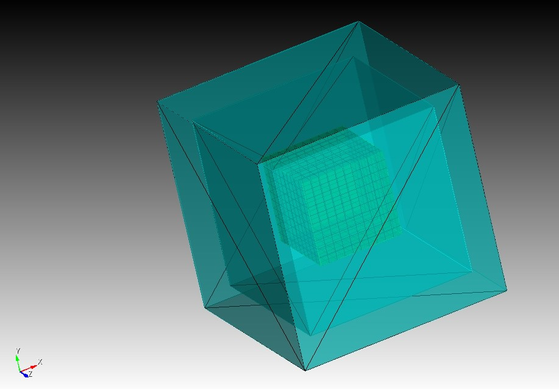
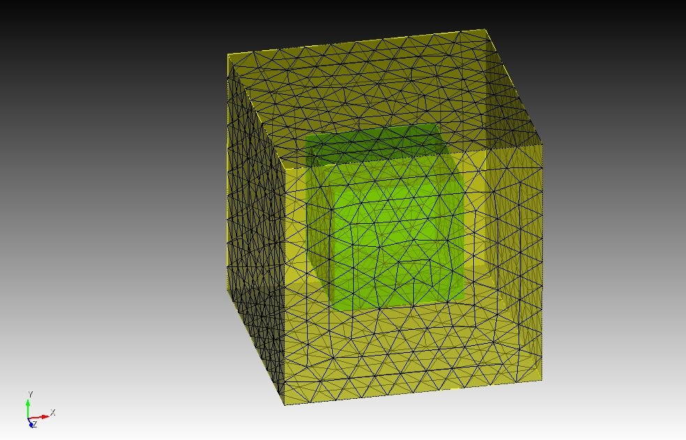
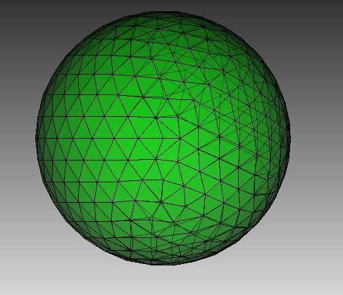
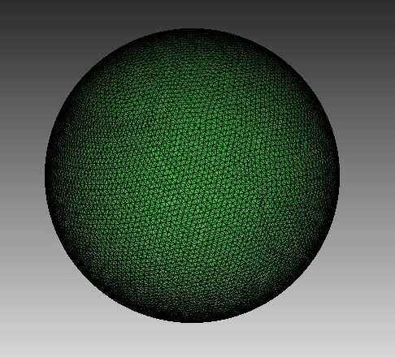

## DAGMC - Basic geometry tutorial

In this tutorial, you will learn how to:
- Create basic geometries in Coreform Cubit
- Export DAGMC models into OpenMC.

---

## Simple Cube Geometry
For this first case, we will introduce the basic concepts for building a simple geometry in Cubit and exporting it as a DAGMC (.h5m) file.

In Cubit, we can build geometry using the GUI, write on a terminal, or load a journal file. All of them will follow the same procedure. In this tutorial, we show how to set up a journal file (.jou) to be run in Cubit to generate a 1 (cm^3) cube centered at the origin.

```python
cubit.cmd( "reset" )

# Create test brick
# This brick will be centered at the origin of the axis (0.0, 0.0 , 0.0)
cubit.cmd("create brick x 1.0 y 1.0 z 1.0")

# Create material tag to be assign to the volume
# This material name will have to match in OpenMC
cubit.cmd("create material 1 name 'mat1'")

# Add volume to block and give name
cubit.cmd("block 1 add volume 1")
cubit.cmd("block 1 name 'fuel'")

# Assign the material tags to the corresponding blocks
cubit.cmd("block 1 material 'mat1'")

# Meshing
# DAGMC geometry requires the surface to be meshed
cubit.cmd("surface all scheme tetmesh")
cubit.cmd("surface all size auto factor 5")
cubit.cmd("mesh surface all")

# Create a graveyard enclosing the domain to apply the vacuum boundary condition
# OpenMC requires a Boundary Conditions (graveyard defines a vacuum BC)
cubit.cmd("create brick x 2.0 y 2.0 z 2.0")
cubit.cmd("create brick x 2.5 y 2.5 z 2.5")
cubit.cmd("subtract body 2 from body 3")
cubit.cmd("block 2 add volume 4")
cubit.cmd("block 2 name 'graveyard'")
cubit.cmd("create material 2 name 'graveyard'")
cubit.cmd("block 2 material 'graveyard'")

# Note: Subtracting erases both original bodies (2 and 3) and creates a new volume ID (4)
# Name as graveyard to be identified in OpenMC as a BC.

# Mesh the enclosing volumes using surface meshes
cubit.cmd("set trimesher coarse on ratio 100 angle 5")
cubit.cmd("surface all scheme trimesh")
cubit.cmd("volume 4 scheme tetmesh")
cubit.cmd("volume 4 size auto factor 10")
cubit.cmd("mesh volume 4")

# Export as a DAGMC file
cubit.cmd("export dagmc 'brick_1.h5m' overwrite")

```
[brick_1.jou](./journal_files/brick_1.jou)

This will generate a cube with an enclosing graveyard:


This geometry will be saved in Cubit’s workspace with the name `brick_1.h5m`. This can be directly imported into the OpenMC’s Python API.

```python
import openmc

model = openmc.Model()
# Attribute materials to regions
ss316 = openmc.Material(name="mat1") # The name has to match the DAGMC material
ss316.add_element('C', 0.0003, 'wo')
ss316.add_element('Mn', 0.02, 'wo')
ss316.add_element('Si', 0.01, 'wo')
ss316.add_element('P', 0.0005, 'wo')
ss316.add_element('S', 0.0002, 'wo')
ss316.add_element('Cr', 0.185, 'wo')
ss316.add_element('Mo', 0.025, 'wo')
ss316.add_element('Ni', 0.13, 'wo')
ss316.add_element('Fe', 0.629, 'wo')
ss316.set_density("g/cm3", 8.0)

model.materials = openmc.Materials([ss316])

# import DAGMC geometry
dagmc_univ = openmc.DAGMCUniverse(filename='brick_1.h5m')
model.geometry = openmc.Geometry(root=dagmc_univ)

# define simulation settings
model.settings.dagmc = True  # use dagmc geometry
model.settings.batches = 10
model.settings.particles = 10000
model.settings.run_mode = "fixed source"

# define the neutron source
source = openmc.Source()
source.space = openmc.stats.Point((0.0, 0.0, 0.0))  # (x, y, z) in cm
source.angle = openmc.stats.Isotropic()
source.energy = openmc.stats.Discrete([14.08e6], [1.0])
model.settings.source = source

# provide tallies
brick_cell_filter = openmc.CellFilter(1)
tally = openmc.Tally(name="brick_tally")
tally.filters = [brick_cell_filter]
tally.scores = ['flux', 'total']  # or 'fission', 'absorption', etc.
tallies = openmc.Tallies([tally])
model.tallies = tallies

model.export_to_xml()
```
[brick_1_dagmc.py`](./python_files/brick_1_dagmc.py)

For comparison, we also generate the same physical system with Constructive Solid Geometry (CSG).

```python
# Define surfaces for the cube (BC)
x0 = openmc.XPlane(x0=-0.5, boundary_type='vacuum')
x1 = openmc.XPlane(x0=0.5, boundary_type='vacuum')
y0 = openmc.YPlane(y0=-0.5, boundary_type='vacuum')
y1 = openmc.YPlane(y0=0.5, boundary_type='vacuum')
z0 = openmc.ZPlane(z0=-0.5, boundary_type='vacuum')
z1 = openmc.ZPlane(z0=0.5, boundary_type='vacuum')

# Create a region inside all six surfaces
region = +x0 & -x1 & +y0 & -y1 & +z0 & -z1

# define boundary conditions
cell = openmc.Cell(region =region, fill=mat1)
universe = openmc.Universe(cells=[cell])
geometry = openmc.Geometry(universe)
model.geometry= geometry
```
[brick_1_csg.py`](./python_files/brick_1_csg.py)

The tally outcomes for both simulations match exactly, as shown in Table 1.
	
**Table 1: DAGMC and CSG tally solution for simple Cube geometry.**

| Tally |          DAGMC           |          CSG            |
|-------|--------------------------|-------------------------|
| Flux  | 0.633844 +/- 0.000755311 | 0.633844+/- 0.000755311 |


## Two materials  (Cubes)

In this example, we explore the construction of two concentric cubes with different materials. Cube 1 (side 1 cm) has material 1, and it is surrounded by a larger cube (side of 2 cm) which has material 2.

The construction of this geometry is available in the .jou file below. Some additional steps are used to ensure that the surfaces between volumes are correctly merged.

```python
cubit.cmd( "reset" )

# Create cubes
cubit.cmd("create brick x 1.0 y 1.0 z 1.0") # Initial cube 1
cubit.cmd("create brick x 1.0 y 1.0 z 1.0")
cubit.cmd("create brick x 2.0 y 2.0 z 2.0")
cubit.cmd("subtract volume 2 from volume 3") # creating shell cube 2
cubit.cmd("remove overlap volume 1 4 modify volume 4")

# Ensure proper connection between inner and outer bricks and compress IDS
cubit.cmd("imprint volume all")
cubit.cmd("merge volume all")
cubit.cmd("compress all")

# Create a material tag to be assigned to the volume
cubit.cmd("create material 1 name 'mat1'")
cubit.cmd("create material 2 name 'mat2'")

# Add volume to the block and give a name
cubit.cmd("block 1 add volume 1")
cubit.cmd("block 1 name 'mat1'")
cubit.cmd("block 2 add volume 2")
cubit.cmd("block 2 name 'mat2'")

# Assign the material tags to the corresponding blocks
cubit.cmd("block 1 material 'mat1'")
cubit.cmd("block 2 material 'mat2'")

# Meshing
cubit.cmd("surface all scheme trimesh")
cubit.cmd("surface all size 0.05")
cubit.cmd("mesh surface all")

# Export as a DAGMC file
cubit.cmd("export dagmc 'brick_2.h5m' overwrite")
``` 
[brick_2.jou](./journal_files/brick_2.jou)

Which results in:



In this example, we skipped the construction of the graveyard. This is possible because there are other ways to define a graveyard directly in OpenMC. For example, using (<code>bounded_universe()</code>).

```python
# import geometry
dagmc_univ_bounded = openmc.DAGMCUniverse(filename='brick_2.h5m').bounded_universe()
model.geometry = openmc.Geometry(root=dagmc_univ_bounded)
```
[brick_2_dagmc.py](./python_files/brick_2_dagmc.py)

Now, we define the materials in each volume:

```python
# Attribute nuclides/elements to dagmc materials
# brick 1 (inside material) - water
water = openmc.Material(name="mat1")
water.add_nuclide('H1', 2.0)
water.add_nuclide('O16', 1.0)
water.set_density('g/cm3', 1.0)

# brick 2 (outside material) - ss316
ss316 = openmc.Material(name="mat2")
ss316.add_element('C', 0.0003, 'wo')
ss316.add_element('Mn', 0.02, 'wo')
ss316.add_element('Si', 0.01, 'wo')
ss316.add_element('P', 0.0005, 'wo')
ss316.add_element('S', 0.0002, 'wo')
ss316.add_element('Cr', 0.185, 'wo')
ss316.add_element('Mo', 0.025, 'wo')
ss316.add_element('Ni', 0.13, 'wo')
ss316.add_element('Fe', 0.629, 'wo')
ss316.set_density("g/cm3", 8.0)

model.materials = openmc.Materials([water, ss316])
```

For the CSG comparison, the geometry is defined as:

```python
# Surfaces
# Inner cube (1x1x1)
x1_min = openmc.XPlane(x0=-0.5)
x1_max = openmc.XPlane(x0=0.5)
y1_min = openmc.YPlane(y0=-0.5)
y1_max = openmc.YPlane(y0=0.5)
z1_min = openmc.ZPlane(z0=-0.5)
z1_max = openmc.ZPlane(z0=0.5)

# Outer cube (2x2x2)
x2_min = openmc.XPlane(x0=-1.0, boundary_type='vacuum')
x2_max = openmc.XPlane(x0=1.0, boundary_type='vacuum')
y2_min = openmc.YPlane(y0=-1.0, boundary_type='vacuum')
y2_max = openmc.YPlane(y0=1.0, boundary_type='vacuum')
z2_min = openmc.ZPlane(z0=-1.0, boundary_type='vacuum')
z2_max = openmc.ZPlane(z0=1.0, boundary_type='vacuum')

# Regions
# Inner cube: material 1
inner_region = +x1_min & -x1_max & +y1_min & -y1_max & +z1_min & -z1_max
# Outer hollow shell: material 2
outer_shell_region = (+x2_min & -x2_max & +y2_min & -y2_max & +z2_min & -z2_max) & ~inner_region
# Cells
inner_cell = openmc.Cell(name='Inner Cube', fill=mat1, region=inner_region)
outer_cell = openmc.Cell(name='Outer Shell', fill=None, region=outer_shell_region)
# Define the universe
root_universe = openmc.Universe(cells=[inner_cell, outer_cell])
geometry = openmc.Geometry(root_universe)
geometry.export_to_xml()
```
[brick_2_csg.py](./python_files/brick_2_csg.py)

The flux tally outcome is presented in Table 2:

**Table 2: Flux tallies for two-material cubes**

| Material | DAGMC                  | CSG                    |
|----------|------------------------|------------------------|
| Water    | 0.626052 ± 0.00044213  | 0.626191 ± 0.00053895  |
| SS316    | 0.657283 ± 0.00101011  | 0.657232 ± 0.00115063  |


---

One can see that these values differ, but are within statistical variance.

## Sphere (Smooth Surfaces)
Some complications may arise from using a polygonal surface mesh to approximate complex smooth surfaces. Depending on the mesh refinement, the solution of the DAGMC model can vary significantly from the CSG counterpart. For simplicity, we opted to just show the difference between .jou file inputs. The complete .jou and .py files are available in the repository.

For the case of a simple sphere of radius 0.5. We introduce the following command on Coreform Cubit:
```python
# Create sphere r=0.5
cubit.cmd("create sphere radius 0.5")
```
However, we test two different meshing schemes:

- Coarse mesh
```python
# Meshing
cubit.cmd("volume all size 0.1")
```


- Fine mesh
```python
# Meshing
cubit.cmd("volume all size 0.02")
```



The flux solution obtained for both DAGMC (coarse and fine meshes) and CSG is shown in Table 3:

**Table 3: Flux tally comparison for sphere**

| Method         | Flux                   |
|----------------|------------------------|
| DAGMC (coarse) | 0.513137 ± 0.00031960  |
| DAGMC (fine)   | 0.515629 ± 0.00031293  |
| CSG            | 0.515730 ± 0.00031296  |


It is visible that the DAGMC finer mesh displayed a closer solution to the CSG (being within statistical variance). As expected, a finer mesh can better represent the smooth surface and therefore obtain a more accurate neutron flux simulation.

---


